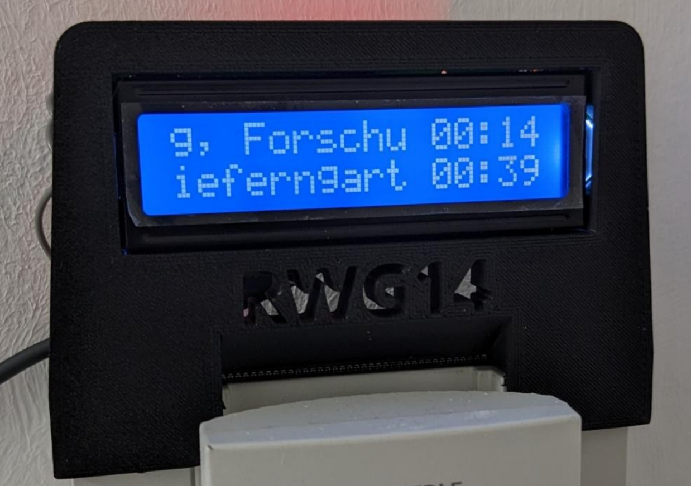

RWG14 U-Bahn info lcd
==


This is a quick project to display the u-bahn departures on a tiny LCD-Display drived by an ESP-8266.

The code is messy and buggy, but it works most of the times.

Feel free to contribute.

## 3D printed case

The project is built using onshape, you can find it [here](https://cad.onshape.com/documents/4cfa5dc36456369292055810/w/ded39fbb8976b1313e275f47/e/70286f618e97350361bcf75a?renderMode=0&uiState=648ed8100f1b227abbc9a467):

## Setup

copy `include/wifi-creds.h.example` to `include/wifi-creds.h` and edit the credentials accordingly.

build the project using platformio


Connect the esp8266, the build and upload using
```bash
pio run -t upload
```
